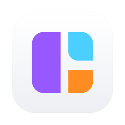

<div align="center">



# Unhog

**Find out what's hogging your Mac — and stop it safely, in one click.**

A native macOS menu-bar app that turns "why is my fan screaming?" into a clear,
honest answer and a single, reversible action.

[](https://github.com/flazouh/unhog-macos/releases/latest)
[](https://github.com/flazouh/unhog-macos/releases)
[](LICENSE)


### [⬇️  Download the latest release](https://github.com/flazouh/unhog-macos/releases/latest)

</div>

---

## What it does

Your Mac slows down. The fans spin up. Something is eating your RAM, CPU, or
battery — but Activity Monitor throws a wall of cryptic process names at you.

Unhog answers one question:

> **What is hogging this Mac, and can I stop it safely?**

It groups related processes into understandable families — Playwright,
TypeScript servers, Nx, and normal apps — and shows each major workload as a
share of your installed RAM. When something looks off, Unhog explains the
project and process chain behind it, stops that verified workload, then measures
what actually changed.

- **CPU** is measured from real process-time deltas, not a noisy instantaneous read.
- **Memory** uses physical footprint, with resident memory as a fallback.
- **Everything stays on your Mac.** No accounts, no telemetry, no network calls.

## Install

1. **[Download the latest `.dmg`](https://github.com/flazouh/unhog-macos/releases/latest)**
2. Open it and drag **Unhog** into your **Applications** folder.
3. Launch it. Unhog lives in your menu bar — click the icon to open it.

The app is signed with a Developer ID and notarized by Apple, so it opens
without Gatekeeper warnings. Requires **macOS 14 (Sonoma) or newer**.

Prefer to verify the download? Each release ships a `.sha256` checksum:

```sh
shasum -a 256 -c Unhog-<version>.dmg.sha256
```

## Highlights

- **Resource Lens** — a compact map of 100% of your installed RAM, with stable
  per-app colours and an honest "unattributed" remainder. No pretending process
  totals equal system memory.
- **One dominant story** — when there's an incident, you get one clear
  explanation (project → process chain → top worker) and one primary action.
- **Safe, reversible stopping** — a normal AppKit quit for GUI apps or `SIGTERM`
  for developer-tool families, with force-quit only offered as a deliberate
  second step.
- **Recovery receipt** — after stopping something, Unhog measures the
  before-and-after so you can see it actually helped.
- **Branch-scoped stopping** — kill just part of a process stack instead of the
  whole family.
- **Storage overview** — read-only disk capacity plus an on-demand, cancellable
  scan of common folders. It never scans automatically and never deletes.
- **Local agents view** — recent Codex and Claude sessions with project, model,
  and a compact context-window map.
- **Quiet by default** — machine-scaled sustained-load detection means short
  compile spikes and normal large apps don't spam you. Notifications fire only
  after 20 seconds of genuine high load.

## Safety first

Unhog can only ever touch processes owned by you, and it re-validates the exact
PID, process start time, and owner *immediately* before sending any signal.
Permanently protected: macOS system processes, other users' processes, PID 0/1,
and Unhog itself. Automatic force-killing is intentionally **not** part of this
release — stopping is always something you choose.

## Build from source

Requirements: **macOS 14+** and **Xcode 16+**.

```sh
chmod +x scripts/package-app.sh
./scripts/package-app.sh
open dist/Unhog.app
```

The locally packaged app is ad-hoc signed for development use.

Run the behaviour suite:

```sh
swift test
```

The tests cover process-family grouping, separation of unrelated sessions,
sustained-vs-short CPU pressure, cooldown behaviour, and the current-user /
system-path / self-termination safety guarantees.

Before every commit or release, run the full quality gate:

```sh
./scripts/verify.sh
```

This lints with `swift format`, does a clean from-scratch compile, and runs the
tests. The same gate runs in CI on every push and pull request, and
`scripts/release-app.sh` runs it before anything is signed or notarized — a
build that fails lint, compile, or tests can never be released.

## Architecture

```text
SystemProcessSampler     -> immutable ProcessSample values
ProcessGrouper           -> understandable process families
ResourcePressureDetector -> sustained, explainable incidents
MemoryComposition        -> installed-RAM shares and honest remainder
StorageScanner           -> volume capacity and ranked folder usage
AgentSessionScanner      -> local Codex and Claude context snapshots
ResourceExplainer        -> project, process chain, and top worker
RecoveryVerifier         -> recovered, restarted, or still running
TerminationPolicy        -> pure safety decision
SystemProcessTerminator  -> revalidate identity, then signal
AppStore                 -> UI state and user intents
SwiftUI views            -> presentation only
```

Views never call process or signal APIs directly. The termination path first
builds a pure safety plan, then re-validates the PID, start time, and owner
again just before sending `SIGTERM` or `SIGKILL`.

## Known limits

- Unhog can only stop processes owned by the current user.
- Family detection is heuristic and currently specialises in the developer
  tools that caused the original incidents.
- The grey RAM-map remainder deliberately combines macOS, untracked processes,
  and free memory.
- Notification action buttons and user-defined automatic rules are planned, but
  intentionally left out of this safety-first release.

## Contributing

Contributions are welcome — please read [CONTRIBUTING.md](CONTRIBUTING.md)
before changing process grouping or termination behaviour, and see
[SECURITY.md](SECURITY.md) to report a vulnerability.

Unhog is open source under the [MIT License](LICENSE).
